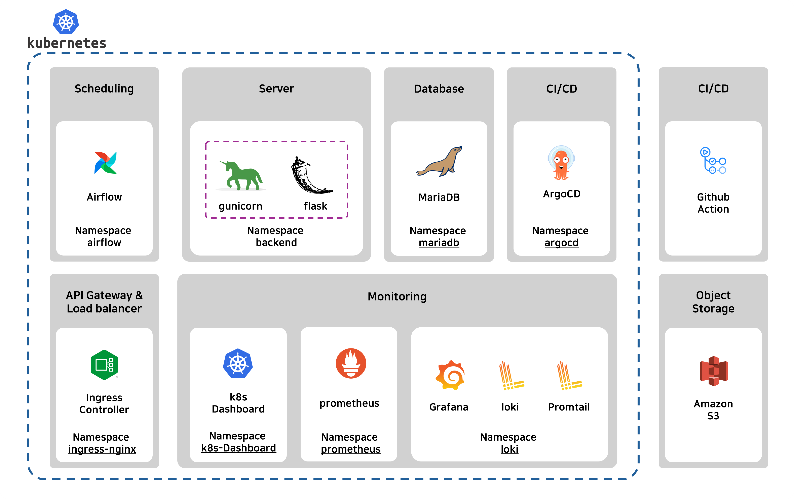

# 짠내나는 데이터 파이프라인 구축기
 
 

# **목적** :
- ### **데이터 파이프라인 구축 및 개념 정리**: 

    - #### 데이터 파이프라인을 직접 구축해보면서 데이터 흐름을 설계 및 이해하고, 실제 상황에서 발생할 수 있는 다양한 문제점들을 직접적으로 해결하고 식별하고 해결 방안을 모색합니다. 
- ### **데이터 엔지니어링 기술 스택 실습**: 

    - #### 데이터 엔지니어링에 필요한 기술 스택을 실제로 사용해봄으로써, 이론적 지식과 실질적 기술을 습득하고자 하였습니다.
- ### **Kubernetes (k8s) 복기 및 정리**: 

    - #### 이전 프로젝트에서 경험했던 Kubernetes (k8s)에 대해 재고하고 정리하고, 데이터 파이프라인과 데이터 처리 작업에 Kubernetes를 효과적으로 활용하는 방법을 탐색합니다.
 

# 프로젝트 설명:

### **1. 데이터 수집**

- **목표:** NBA 농구 선수들의 기본적인 스탯(통계 데이터)를 매일 수집합니다.
- **방법:** 수집 대상은 선수별 포인트, 리바운드, 어시스트, 스틸, 블록 등의 경기 기록이 될 수 있습니다. 이 데이터는 공식 NBA 사이트나 스포츠 통계 사이트에서 API를 통해 자동으로 수집할 수 있습니다.
- **저장:** 수집한 데이터는 클라우드 스토리지 서비스인 Amazon S3에 저장됩니다. 이는 높은 가용성과 데이터 내구성을 보장하며, 대규모 데이터를 효율적으로 관리할 수 있는 환경을 제공합니다.

### **2. 데이터 처리 및 DB 적재**

- **목표:** 수집한 데이터를 통계적 방법을 사용해 변환하고 분석하여, 각 선수의 경기에 미치는 영향을 파악합니다.
- **변환 과정:** 데이터는 전처리 과정을 거쳐 불필요한 정보를 제거하고, 선수별 경기 영향력을 나타내는 지표로 변환됩니다.
- **DB 적재:** 변환된 데이터는 관계형 데이터베이스(RDBMS)인 MariaDB에 적재합니다. 이 과정에서 데이터는 추후 분석 및 시각화에 용이하도록 구조화됩니다.

### **3. 데이터 시각화**

- **목표:** 적재된 데이터를 바탕으로 시각적 분석을 제공하여, 선수들의 경기 영향력과 성능을 직관적으로 이해할 수 있게 합니다.
- **도구:** 시각화에는 Tableau, Power BI, Google Data Studio 등의 도구를 사용할 수 있으며, 대시보드 형태로 주요 지표를 한눈에 파악할 수 있도록 디자인합니다.
- **활용 예:** 시각화된 데이터는 코치나 팀 매니지먼트에 의해 선수 선발, 전략 수립, 경기 분석 등에 활용될 수 있습니다.

 

# 프로젝트 구조
